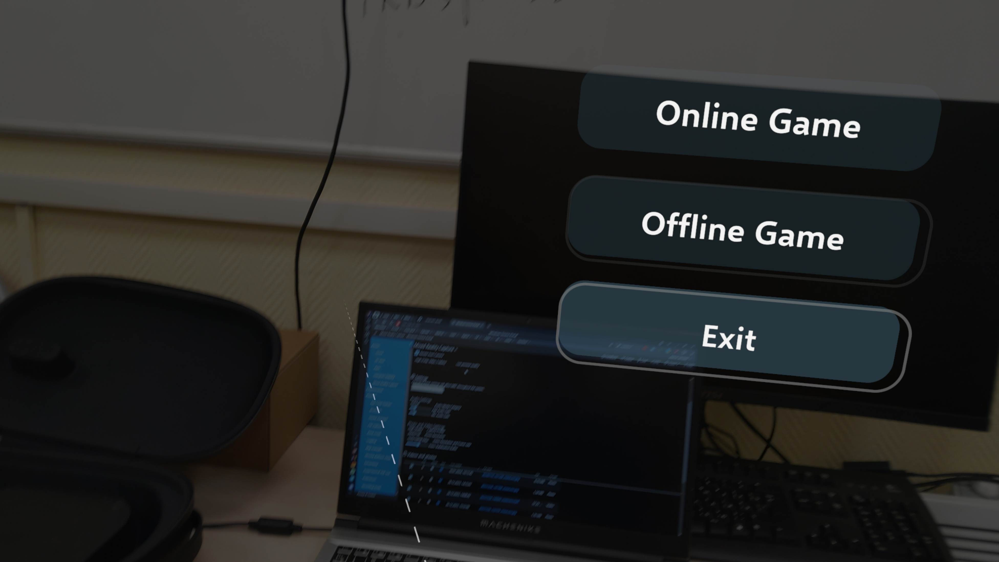
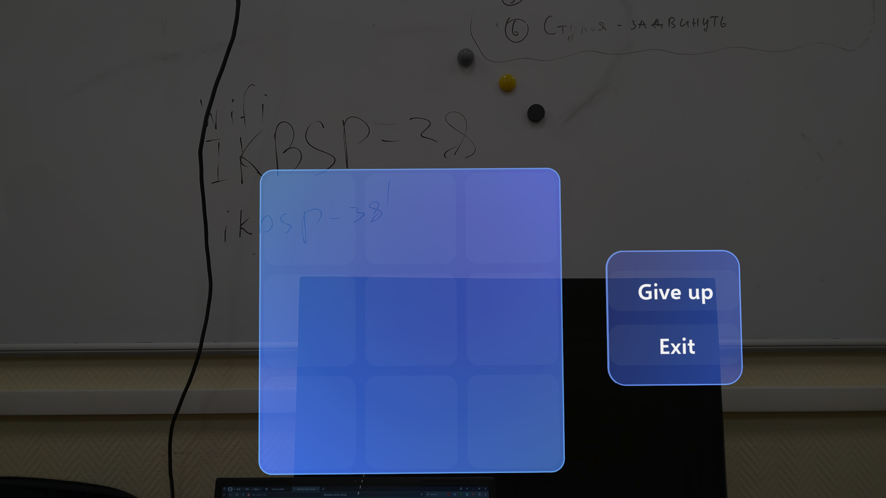
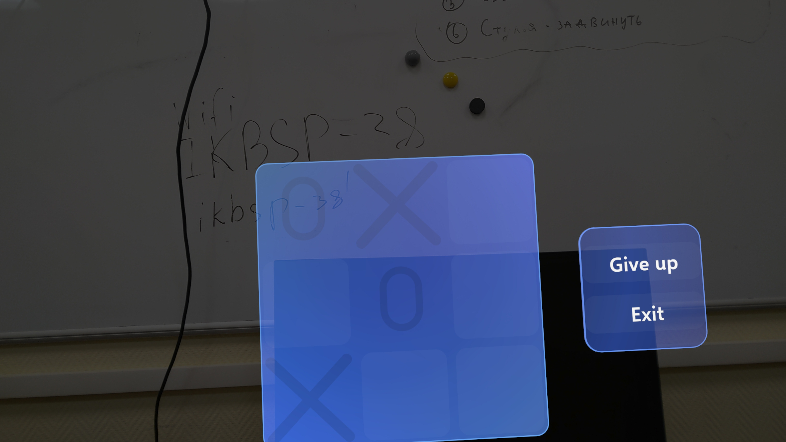

# Tic Tac Toe in MR for HoloLens 2

Eng | [Rus](resources/localization_readme/README_RU.md)

## Description

An example application for HoloLens 2 showcasing some capabilities of the Mixed Reality Toolkit (MRTK) for Unity. The application allows playing Tic Tac Toe in augmented reality.

In addition to playing against the computer, there is an implementation of an online mode with server logic. However, external connection via IP in the local network and the internet proved challenging to configure. As a result, the online mode only works if both players are on the same device.

## License

``` text
MIT License
```

## Screenshots





